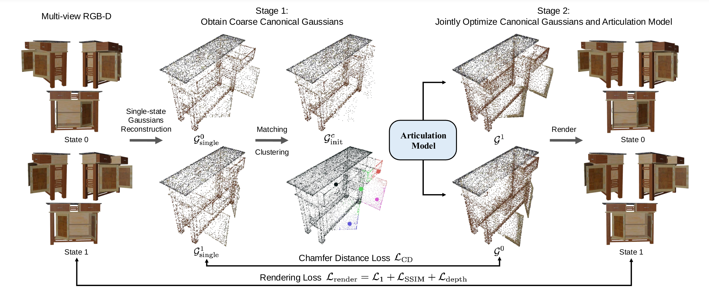

# **ArtGS**: Building Interactable Replicas of Complex Articulated Objects via Gaussian Splatting
# ICLR 2025

    
        <a href="https://yuliu-ly.github.io" target="_blank">Yu Liu✶</a>1,2,
    
        <a href="https://buzz-beater.github.io" target="_blank">Baoxiong Jia✶</a>2,
    
        <a href="https://github.com/Jason-aplp" target="_blank">Ruijie Lu</a>2,3,
    
        <a href="https://dali-jack.github.io/Junfeng-Ni" target="_blank">Junfeng Ni</a>1,2,
    
        <a href="https://zhusongchun.net" target="_blank">Song-Chun Zhu</a>1,2,3,
    
        <a href="https://siyuanhuang.com" target="_blank">Siyuan Huang</a>2
     
    
✶ indicates equal contribution

    
        1Tsinghua University &nbsp&nbsp 
        2National Key Lab of General AI, BIGAI &nbsp&nbsp 
        3Peking University
    

[Website](https://articulate-gs.github.io/) | [Arxiv](https://arxiv.org/abs/2502.19459) | [Data](https://drive.google.com/drive/folders/1h2axr5TCYKnYHZ8ZPTJeb5qTm-f7UNEG?usp=sharing)

Code will be realesed soon.

## Reconstruct Interactable Replicas
<video controls>
  <source src="assets/videos/demo.mp4" type="video/mp4">
  Your browser does not support the video tag.
</video>

